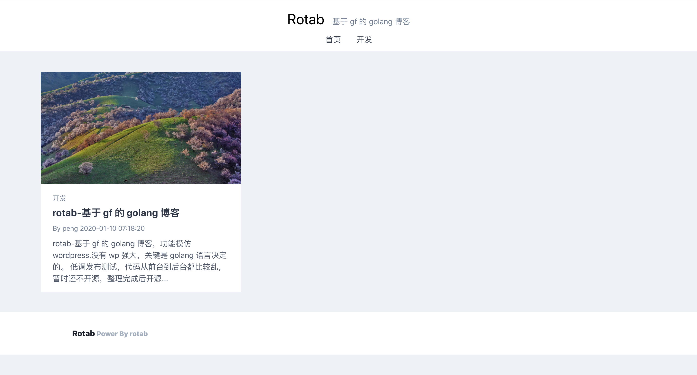
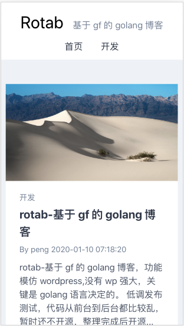
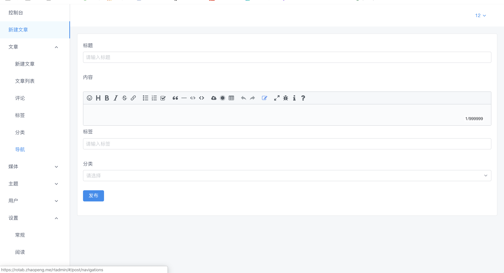

# rotab 基于 goframe 的 golang 博客，

rotab 基于 goframe 的 golang 博客，功能模仿 wordpress,没有 wp 强大，关键是 golang 语言决定的。

由于精力有限,最近不会有更新.

## 功能

完整的一个博客系统,支持标签 分类 评论 评论审核 评论无线嵌套 主题等

> 为了开发方便,目前数据库使用 sqlite,可以很容易的切换到其他关系型数据库.

## 在线试用

[https://rotab.zhaopeng.me](https://rotab.zhaopeng.me)

> 数据库使用 sqlite, 服务器在国外,也没有加缓存,所以国内打开会比较慢.

## 预览

首页

移动端首页

后台

## 技术

### 后台

基于 goframe 来实现,轻量级的封装 mvc,让从其他语言转到 golang 的同学们感觉到熟悉的面孔,包含 `controller` `service` `dao`.

### 页面渲染

使用 goframe 提供模板引擎实现,封装了一写常用函数.

> 说实话,模板引擎还是比较弱,而且写起来很麻烦,如果不是为了 seo 考虑,不会考虑使用模板引擎的.
> 下次如果有大的升级,我会考虑使用 `ssr` 技术,比如 vue 的 nuxt 或者 react 的 nest.

### 后台管理

后台采用 vue 实现,基本一个可用的 admin 管理系统.目前vue admin 相关很多,我也撸了一个 admin 管理系统,正在完善中.可用后,开源.

# 开源协议

mit
